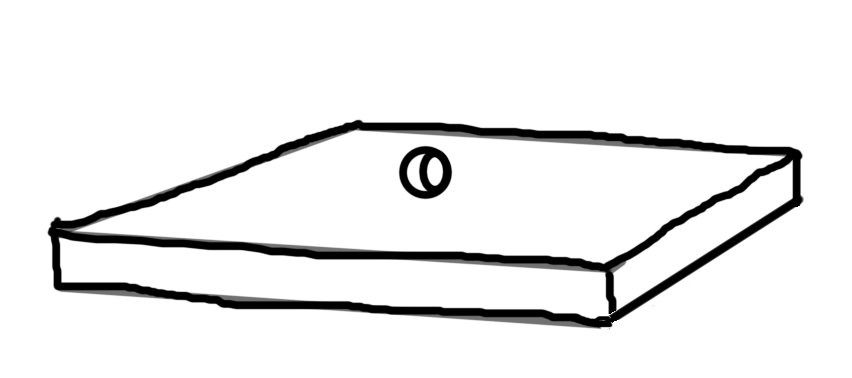

# WebGLDemo
A little demo game to show what can be done with WebGL.

This demo is made for the GameJam 2015 at the FHV.

## Game Idea

The basic game idea is: balancing a ball on a board. If the ball falls from the
board the player looses. The goal of the game is to keep the ball as long as
possible on the board to get points.

This simple image should give you a picture on how the game will look like:

This game will be in 3-D.
